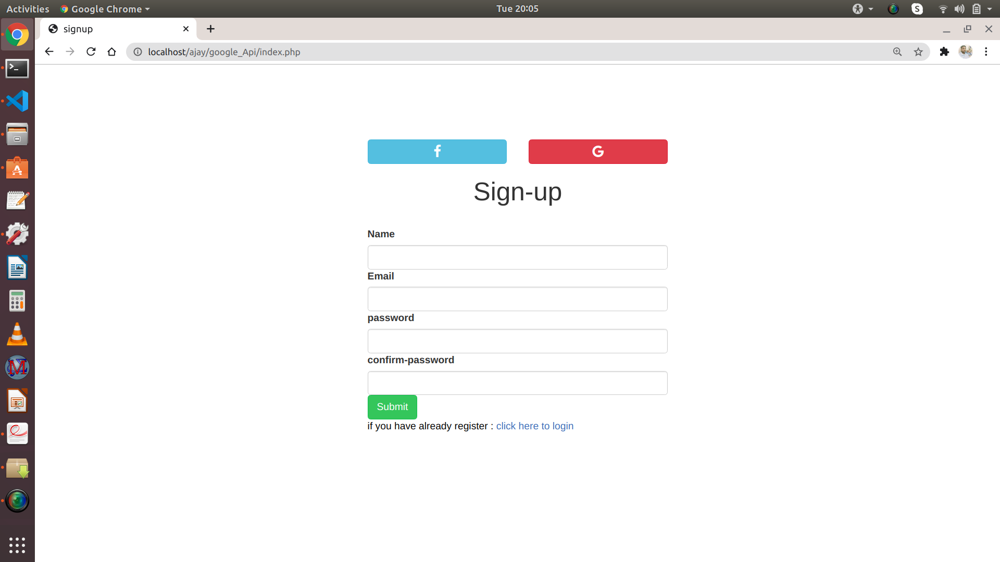

# Objective
*It was a task for Internship. In this, My task was to create a web page ,where i had to give the features to login with Google Account. and here i am  keeping the user logged in for a longer period of time like 1 day  

# Requirments
*. Adding google login to a webpage and keep the user logged in for a longer period of time like 1 day 

# Technologies Used
* Frontend: HTML, CSS, Boostrap 4,
* Backend: PHP, Google-Api

# Snapshots
* Home screen

* Login screen

* Dashboard screen
